## Big Data Architecture			
### Práctica realizada por Josep Cristobal. Entrega el  15/09/2019

. Nos piden diseñar, especificar y desplegar un datalake para el procesamiento de datos provenientes de fuentes de datos no estructurados extraídos mediante técnicas de scraping/crawling de sitios de dominio público.

. El objetivo de esta práctica es montar un servicio para una empresa que gestiona un fondo de inversión y pretende adquirir viviendas, preferentemente pisos, para dedicarlos al alquiler vacacional. También quiere adquirir locales comerciales para alquilarlos, pero con contratos de más larga duración y siempre en zonas donde se pueda mover el turismo que suele alquilar pisos para sus estancias.

* A. La estrategia del proyecto es:
	* La adquisición de datos serán el resultado del scraping/crawling de la web de airbnb, habitaclia y/o milanuncios, siempre en formato .csv.
	* Vamos a informar, diariamente, a las 13:00 y a través del envío de un email, una selección de 10 locales y 10 pisos que estén en venta en las 2 zonas de mayor oferta/demanda de pisos de alquiler que tiene anunciados airbnb.
	* Como información adicional, adjuntaremos el precio medio por metro cuadrado de los pisos y de los locales, de las dos zonas seleccionadas.

* B. En la arquitectura 
	* Alojaremos nuestra infraestructura de Hadoop en Google Cloud.
	* Utilizaremos para guardar nuestos ficheros, Google Storage.
	* Crawlearemos con la herramienta Scrapy, desde un Colaboratory, las webs de milanuncios y habitaclia.
	* Para enviar los correos con la información diaria ya descrita, utilizaremos un servicio rest que nos facilitará nuestro proveedor de correo.
	* El servicio rest recibirá los datos en formato Json que habremos generado con Python. Una vez enviado el correo y habiendo recibido el ok, utilizaremos MongoDB para almacenar los datos pertenecientes al envio del correo para una futura explotación de estos.
	* Para el envío de correos utilizaremos la plataforma de MailChimp.
	* La limpieza de ficheros la realizaremos con Trifacta, si son de gran tamaño. Para datasets pequeños, utilizaremos herramientas como el bloc de notas o similares.

* C. Operación
	* Obtención del dataset de airbnb.csv al inicio del proyecto y de forma periódica, cada 15 días, lo iremos actualizando.
	* Limpieza de dataset.
	* Staging del dataset, subiendolo a Google Cloud Storage.
	* Incorporamos los datos a Hive.
	* Crawlearemos cada dia, a las 12:30, las webs de milanuncios y habitaclia, para extraer los datos necesarios para nuestros cálculos.
	* Limpiamos los datasets de habitaclia.csv y milanuncios.csv generados con el crawler.
	* Subida de los datasets a Google Cloud Storage.
	* Incorporación de datos en Hive.
	* Procesamiento de datos a las 12:55, aplicaremos el proceso necesario para extraer los datos (actualmente no tengo conocimientos necesarios para hacerlo) que nos indicarán los 10 locales y 10 pisos que estén en venta en las 2 zonas de mayor oferta/demanda de pisos de alquiler, fundamentados en los datos de airbnb.
	* Diariamente a las 13:00, envío de correo con los resultados obtenidos, a todas las cuentas suscritas para recibirlo.

## 1. Diagrama de flujo de datos y herramientas utilizadas.

	
## 2. Creamos un scraper en Google Collaboratory a partir de un crawler con scrapy y descargamos los datos a un archivo estructurado.

Se han invertido muchísimas horas en intentarlo y al final los resultados no han sido los esperados. Dejo esta parte para el final. No quiero encallarme en este punto y no poder entregar el resto de práctica.
	
## 2.1 Descarga de dataset de Airbnb.
* Procedemos a la descarga del dataset de airbnb.csv con datos estructurados.
* Aplicamos filtros de limpieza de datos para obtener un dataset más fiable y que no nos provoque problemas. Para ello hemos abierto el bloc de notas para hacer una primera inspección y posteriormente hemos utilizado Trifacta Wrangler para, a través de reglas, limpiar los datos y evitar inconsistencias.

## 3. Montar infraestructura de Cluster para el proyecto.
Vamos a utilizar Google Cloud Platform para montar un cluster de 3 contenedores configurados para alojar Hadoop y sus complementos.
Nos apoyaremos, a nivel de almacenamiento, con Google Cloud Storage.
Procedemos al montaje y detallamos los pasos con las siguientes imágenes y comentarios.

* Creamos el cluster en Google Cloud Plataform

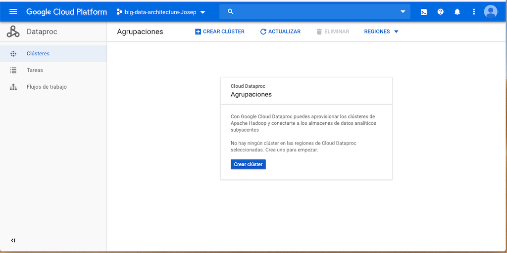

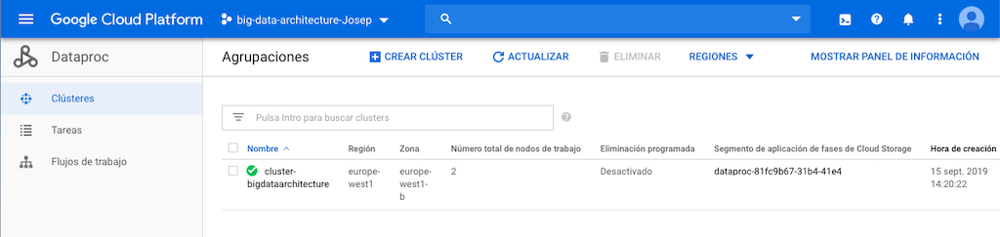

* En el cluster hemos creado una máquina máster y dos esclavas. Para poder acceder a la master por SSH, podemos abrir un terminal directo de Google para trabajar bajo el entorno de navegador.

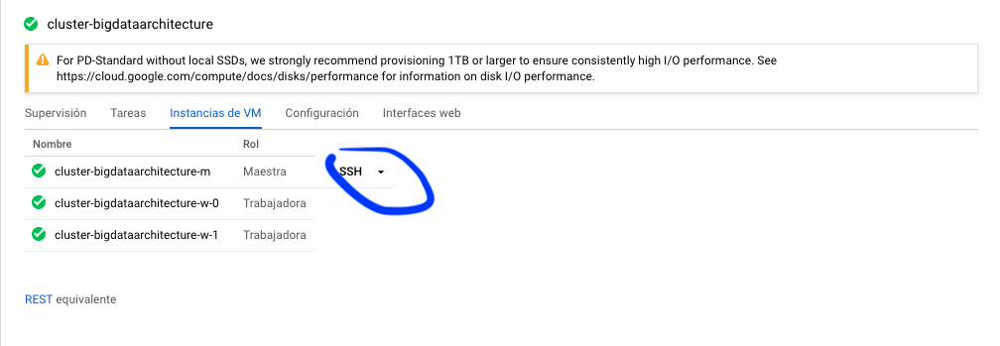

* Una vez montado el cluster, Google nos da unas máquinas preparadas y con todos los servicios que necesitamos par nuestra infraestructura.

## 4. Storage y proceso.

* A continuación, vamos a revisar si Google nos ha montado una unidad de almacenamiento llamada Google Storage y vamos a configurarla.

* El Google Storage lo utilizaremos como lugar de almacenamiento de nuestros datasets y otros ficheros. Con ello evitamos utilizar el HDFS de forma directa (internamente se utiliza) siendo su rendimiento parecido o igual. Otra gran ventaja es, en el momento que destruyamos nuestro cluster, esta unidad no se borra y esto es muy útil si queremos volver a crear otro cluster o acceder a sus datos.

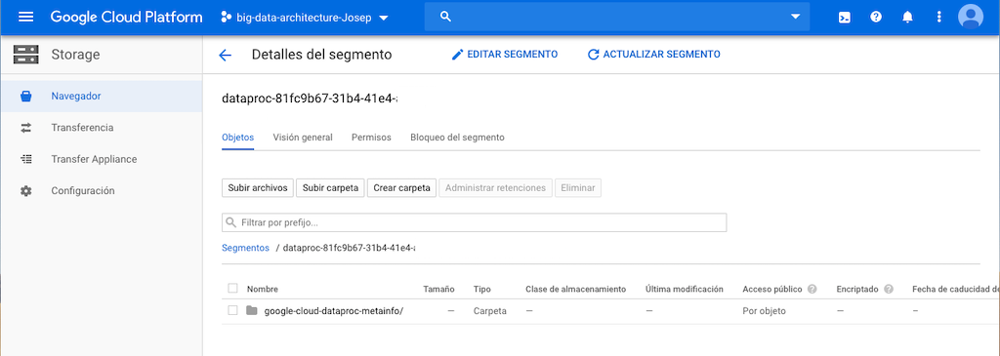

* Ahora dentro de Google Storage, vamos a crear los directorios que utilizaremos para recoger datasets y depositar resultados. 

* Los directorios a crear, son los que se detallan en el Diagrama, en el área de G. Storage.

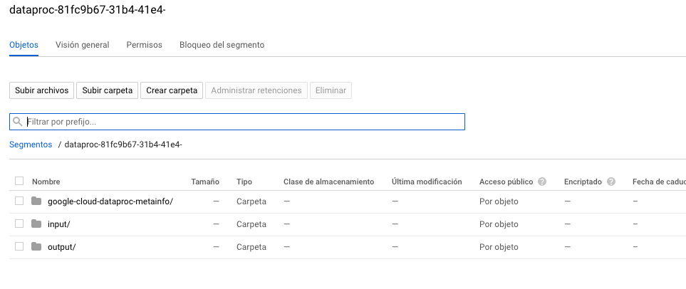

* Una vez montada la infraestructura de Cloud, procederemos a subir los Datasets/ficheros que previamente hemos obtenido por diferentes medios y que hemos limpiado con bloc de notas y/o Trifacta. Cada uno subirá a su carpeta correspondiente, como hemos indicado en el punto anterior, haciéndolo de forma manual (Staging).

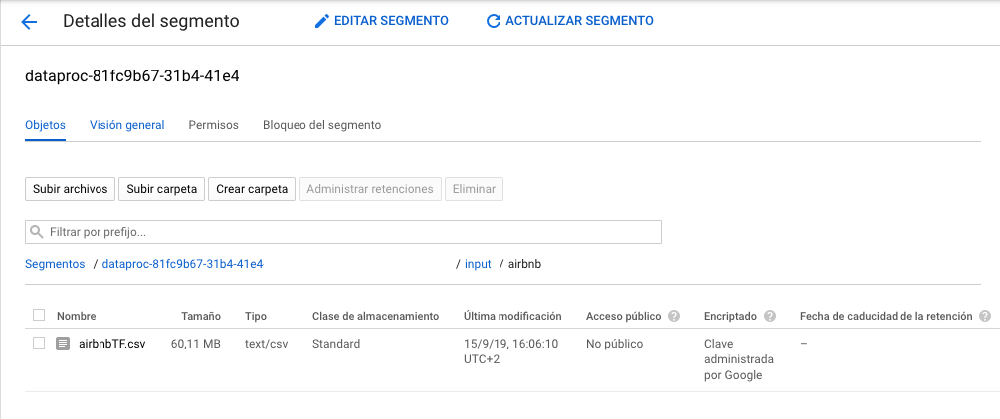

* En este punto ya tenemos nuestros datos subidos al cluster para poder ser procesados.

* Vamos a crear un job donde vamos a lanzar una tarea sobre el dataset de airbnbTF.csv para contar palabras (wordcount). Los resultados los vamos a depositar en un directorio /output dentro de Google Storage.

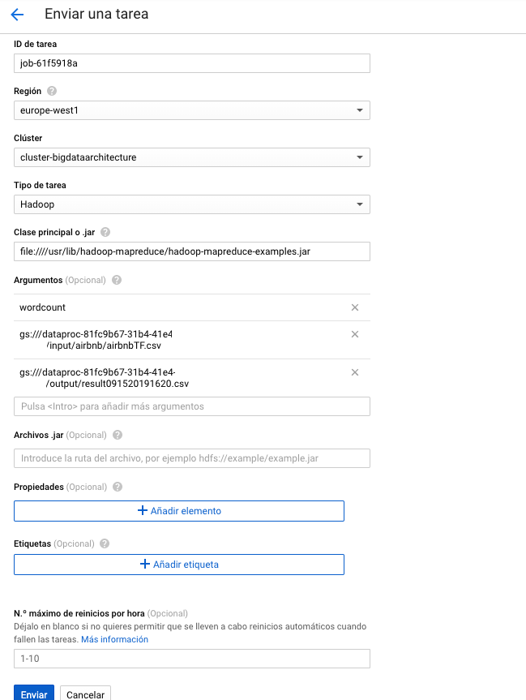

* El primer Job ha fallado, no encontraba la unidad de GS. He modificado la ruta de entrada a gs:///input/airbnb y la de salida en gs:///output/ y todo se ha procesado de forma correcta.

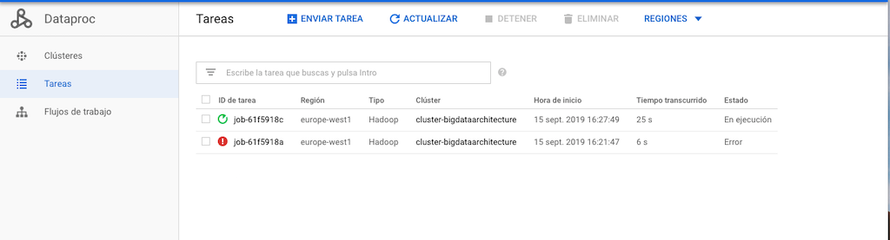

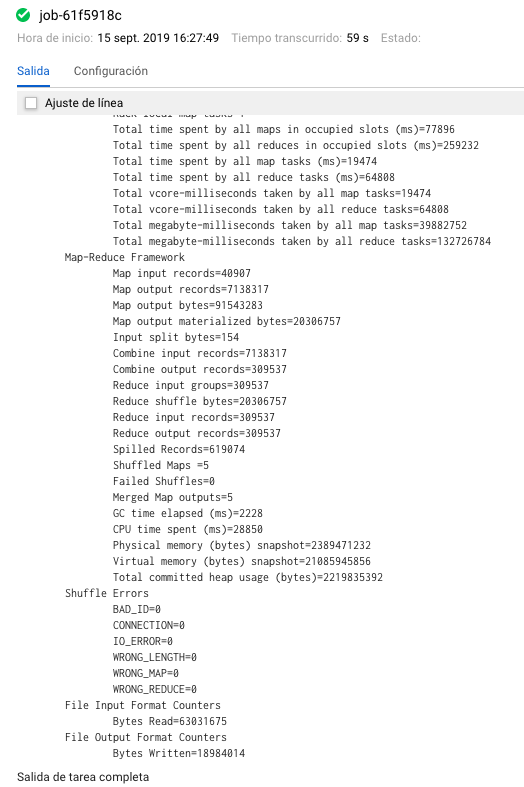

* Y por último, hemos obtenido el resultado en forma de varios ficheros.

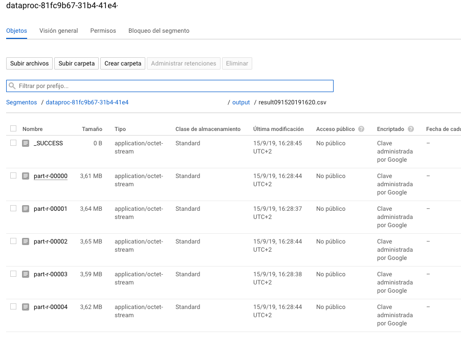

* Con todo ello ya hemos conseguido obtener los datos deseados para ser procesados y enviados por correo a nuestro cliente.

* Para el envío de correos, utilizaremos la plataforma de MailChimp.

* Según recibamos la respuesta del api de MailChimp, guardaremos un registro/objeto en una BBDD Mongo para su posterior explotación.

* Escogemos MailChimp por que nos permite interactuar con su api de forma muy comoda. Es un sistema que lleva tiempo funcionando, es fiable y nos aporta información del estado de los envíos.

 
 ## 4. Hive
 
 * Por último, vamos a utilizar Hive como base para almacenar y analizar los datos de la práctica/proyecto.
 
 * Seguimos trabajando con el cluster de Google cloud que tenemos creado. Hive es una de las piezas que viene ya instalada por defecto y solo tenemos que empezar a utilizarla.
 
 * En primer lugar, abrimos la ventana del CLI que nos facilita Google en su insfraestructura.
 

 * A continuación, utilizaremos el Beeline para ejecutar los comandos de creación, carga y consulta de datos.

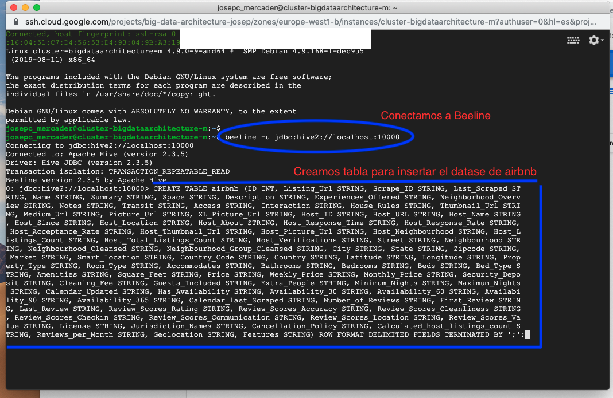

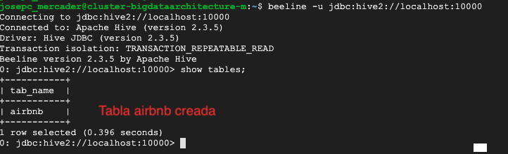

 * Una vez creada la tabla, insertamos los datos que obtendremos del dataset de airbnb, que se encuentra en Google Storage de nuestra infraestructura.
 
 * Una vez ejecutado el proceso, verificaremos que los datos hayan sido cargados correctamente.
 
 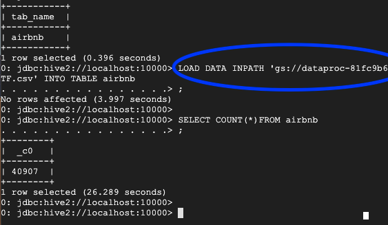
 
 * Ya tenemos todos los datos disponibles para realizar consultas y cálculos.
 
 * Ahora vamos a realizar las consultas que nos darán los datos que perseguimos en nuestro proyecto. El resultado lo dejaremos en Google Storage en la carpeta /output y quedará todo listo para generar el correo electrónico y enviarlo a nuestros clientes con el resultado.
 
 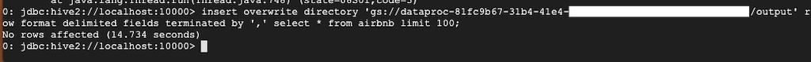
 
 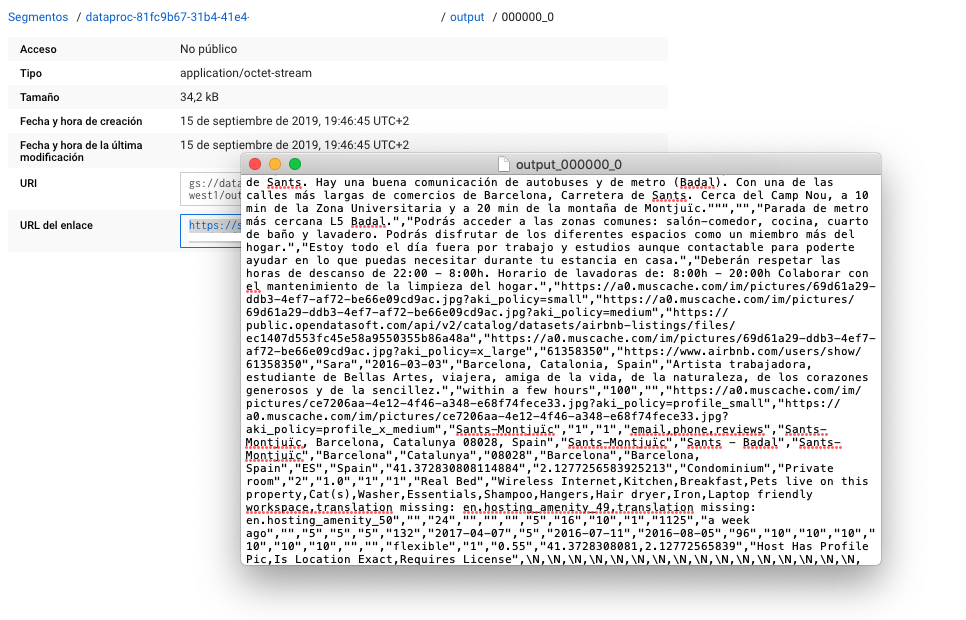
 
 

