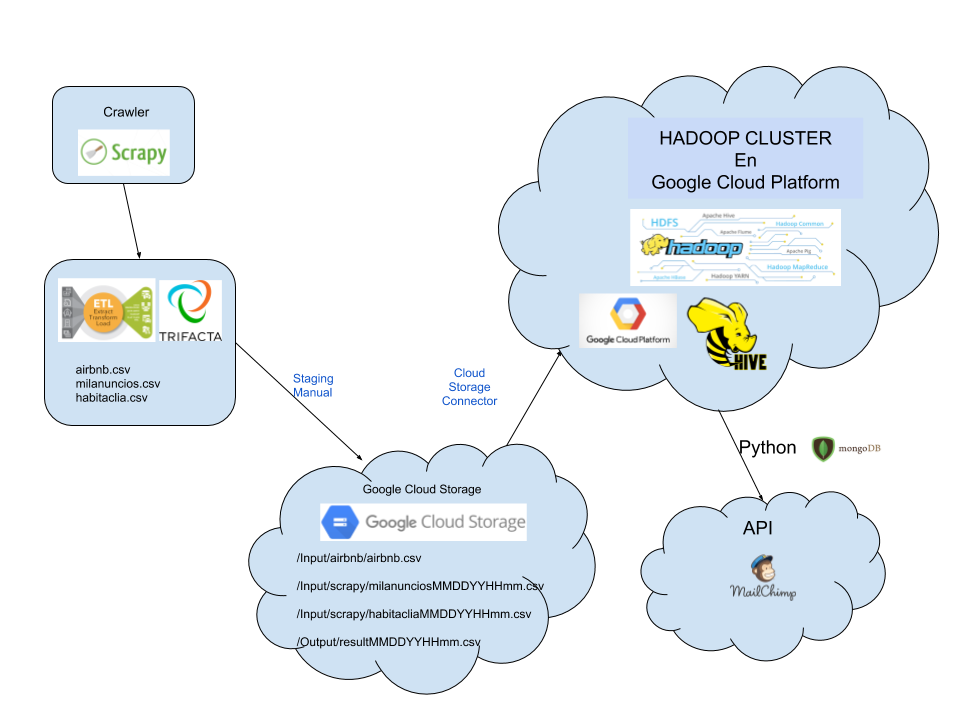
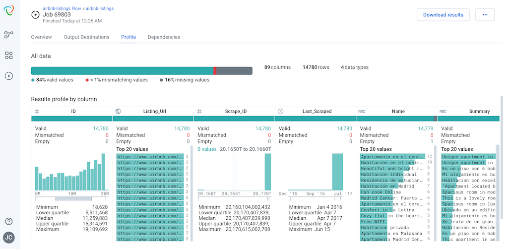

## Big Data Architecture			
### Práctica realizada por Josep Cristobal. Entrega el  15/09/2019

. Nos piden diseñar, especificar y desplegar un datalake para el procesamiento de datos provenientes de fuentes de datos no estructurados extraídos mediante técnicas de scraping/crawling de sitios de dominio público.

. El objetivo de esta práctica es montar un servicio para una empresa que gestiona un fondo de inversión y pretende adquirir viviendas, preferentemente pisos, para dedicarlos al alquiler vacacional. También quiere adquirir locales comerciales para alquilarlos, pero con contratos de más larga duración y siempre en zonas donde se pueda mover el turismo que suele alquilar pisos para sus estancias.

* A. La estrategia del proyecto es:
	* La adquisición de datos serán el resultado del scraping/crawling de la web de airbnb, habitaclia y/o milanuncios, siempre en formato .csv.
	* Vamos a informar, diariamente, a las 13:00 y a través del envío de un email, una selección de 10 locales y 10 pisos que estén en venta en las 2 zonas de mayor oferta/demanda de pisos de alquiler que tiene anunciados airbnb.
	* Como información adicional, adjuntaremos el precio medio por metro cuadrado de los pisos y de los locales, de las dos zonas seleccionadas.

* B. En la arquitectura 
	* Alojaremos nuestra infraestructura de Hadoop en Google Cloud.
	* Utilizaremos para guardar nuestos ficheros, Google Storage.
	* Crawlearemos con la herramienta Scrapy, desde un Colaboratory, las webs de milanuncios y habitaclia.
	* Para enviar los correos con la información diaria ya descrita, utilizaremos un servicio rest que nos facilitará nuestro proveedor de correo.
	* El servicio rest recibirá los datos en formato Json que habremos generado con Python. Una vez enviado el correo y habiendo recibido el ok, utilizaremos MongoDB para almacenar los datos pertenecientes al envio del correo para una futura explotación de estos.
	* Para el envío de correos utilizaremos la plataforma de MailChimp.
	* La limpieza de ficheros la realizaremos con Trifacta, si son de gran tamaño. Para datasets pequeños, utilizaremos herramientas como el bloc de notas o similares.

* C. Operación
	* Obtención del dataset de airbnb.csv al inicio del proyecto y de forma periódica, cada 15 días, lo iremos actualizando.
	* Limpieza de dataset.
	* Staging del dataset, subiendolo a Google Cloud Storage.
	* Incorporamos los datos a Hive.
	* Crawlearemos cada dia, a las 12:30, las webs de milanuncios y habitaclia, para extraer los datos necesarios para nuestros cálculos.
	* Limpiamos los datasets de habitaclia.csv y milanuncios.csv generados con el crawler.
	* Subida de los datasets a Google Cloud Storage.
	* Incorporación de datos en Hive.
	* Procesamiento de datos a las 12:55, aplicaremos el proceso necesario para extraer los datos (actualmente no tengo conocimientos necesarios para hacerlo) que nos indicarán los 10 locales y 10 pisos que estén en venta en las 2 zonas de mayor oferta/demanda de pisos de alquiler, fundamentados en los datos de airbnb.
	* Diariamente a las 13:00, envío de correo con los resultados obtenidos, a todas las cuentas suscritas para recibirlo.

## 1. Diagrama de flujo de datos y herramientas utilizadas.

	
## 2. Creamos un scraper en Google Collaboratory a partir de un crawler con scrapy y descargamos los datos a un archivo estructurado.

Se han invertido muchísimas horas en intentarlo y al final los resultados no han sido los esperados. Dejo esta parte para el final. No quiero encallarme en este punto y no poder entregar el resto de práctica.
	
## 2.1 Descarga de dataset de Airbnb
* Prodedemos a la descarga al dataset de airbnb.csv con datos estructurados.
* Aplicamos filtros de limpieza de datos para obtener un dataset más fiable y que no nos provoque problemas. Para ello hemos abierto el bloc de notas para hacer una primera inspección y posteriormente hemos utilizado Trifacta Wrangler para, a través de reglas, limpiar los datos y evitar inconsistencias.

